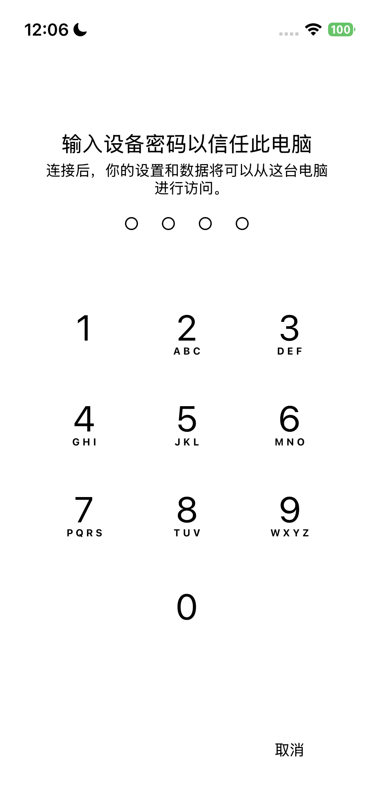
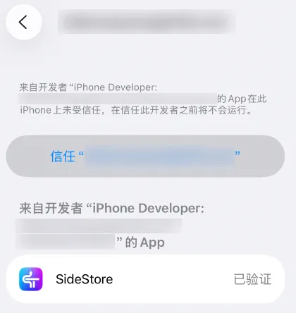
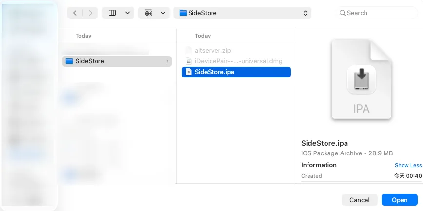
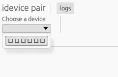
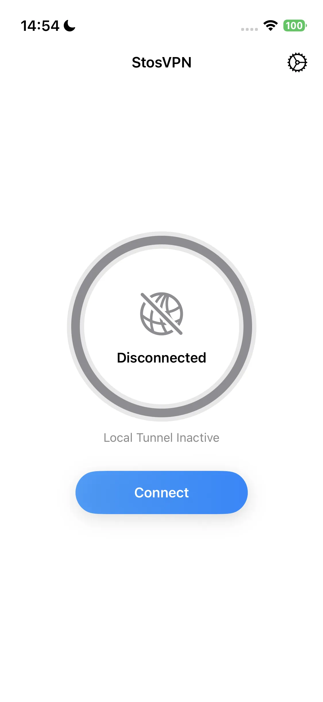
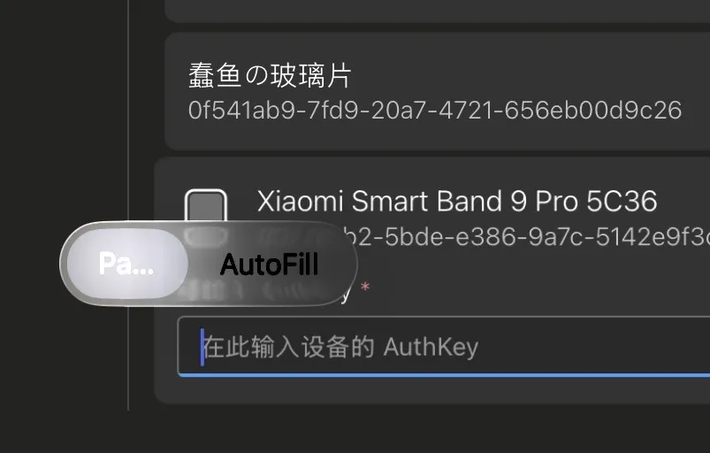

import PurchaseBanner from '@site/src/components/PurchaseBanner';

# AstroBox iOS版使用须知

<PurchaseBanner />

欢迎使用 AstroBox iOS 版！该版本由于开发适配难度较大，因此晚于其它平台上线，在此感谢您的耐心等待！

为了保证您能拥有我们预期中的良好使用体验，不同于其它平台，您有以下特殊事项需要注意：

## 安装

由于软件本身的性质以及我们对私有 API 的使用，AstroBox 将永远不可能上架苹果官方的 AppStore，因此要在 iOS 设备上安装 AstroBox，您必须有一台电脑。如果您已配置好 SideStore / AltStore / LiveContainer / TrollStore 等本地侧载环境，则可以直接下载 ipa 并进行安装；如果并没有，可以参考这篇文章（需挂梯访问）或是下方教程进行配置，然后再安装。

需要注意的是，iOS 版最低要求系统版本必须在 16.5 以上，想要得到更好的体验需要在 17.0 以上。

### 使用电脑直接为 iOS 设备安装 AstroBox

> 本方法的优点是十分简单，但坏处是每次更新都要使用电脑

#### 1.准备工作

首先，你需要准备以下内容才能按照本教程在 iOS 设备上安装 AstroBox：

- iOS 设备

- 电脑
#### 2.前置内容安装

##### Mac

对于 Mac 用户，你需要在 AltStore 或 SideStore 官网 下载以下内容：

- AltServer

接着解压`altserver.zip`，将解压的`AltServer.app1文件拖放到“应用程序”文件夹中。

至此安装过程完成。

##### Windows

对于 Windows 用户，你需要在 AltStore  或 SideStore 官网 下载以下内容：

- AltServer

解压`altserver.zip`，然后运行`setup.exe`来安装 AltServer。Windows 用户相比 Mac 用户需要额外安装非微软应用商店版本的 iTunes 和 iCloud。如果已安装微软应用商店版本，请卸载。

至此，安装过程完成

#### 3.通过 AltServer 安装 AstroBox

首先，你需要通过线连接 iOS 设备与你的 Mac，并在设备上信任你的电脑。

接下来，请你启动 AltServer（首次启动时请在“应用程序”文件夹中右键打开），按住 Option 键，点击顶部菜单栏中的 AltServer 图标，然后选择`AstroBox.ipa`

接下来请按照提示流程，输入 AppleID 与密码，等待 AstroBox 安装完成，iOS 设备上会出现 AstroBox 图标。

接着进入 设置 > 通用 > VPN与设备管理 >  选择开发者 APP 选项 > 点击信任

接着前往设置 > 隐私与安全性 > 开发者模式，开启开发者模式并重启

至此安装完成。

:::tip

<mark class="pink">**需要注意的是：此安装方式可能在七天后失效（？）**</mark>

:::

### 使用电脑在 iOS 设备上建立本地侧载环境后安装 AstroBox

>本方式的优点是可以在 iOS 设备上本地安装 ipa 应用，而不需要每次都使用电脑安装。接下来，我们将以 SideStore 为例进行演示。

#### 1.准备工作

首先，你需要准备以下内容才能按照本教程在 iOS 设备上安装 AstroBox：

- 美区 AppleID（其他非国区区域或许也可以）

- iOS 设备

- 电脑

#### 2.前置内容安装

##### Mac

对于 Mac 用户，你需要在 SideStore 官网 下载以下内容：

- AltServer

- SideStore IPA

- idevice pair

接着打开`altserver.zip`，将解压的`AltServer.app`文件拖放到“应用程序”文件夹中。

然后打开`iDevicePair--macos-universal.dmg`，把文件拖放到“应用程序”文件夹中。

至此安装过程完成。

##### Windows

对于 Windows 用户，你需要在 SideStore 官网 下载以下内容：

- AltServer

- SideStore IPA

- idevice pair

解压`altinstaller.zip`压缩包，然后运行`setup.exe`来安装 AltServer。Windows 用户相比 Mac 用户需要额外安装非微软应用商店版本的 iTunes 和 iCloud。如果已安装微软应用商店版本，请卸载。

接着运行`iDevicePair--windows-x86_64.exe`，完成安装步骤。

至此，安装过程完成。

#### 3.为设备安装SideStore

首先，你需要通过线连接 iOS 设备与你的 Mac，并在设备上信任你的电脑。

接下来，请你启动 AltServer（首次启动时请在“应用程序”文件夹中右键打开），按住 Option 键，点击顶部菜单栏中的 AltServer 图标，然后选择`Sideload.ipa`

接下来请按照提示流程，输入 AppleID 与密码，等待 SideStore 安装完成

接着进入 设置 > 通用 > VPN与设备管理 >  选择开发者 APP 选项 > 点击信任

接着前往设置 > 隐私与安全性 > 开发者模式，开启开发者模式并重启

#### 4.推送配对文件
首先确定你的 iOS 设备有设置密码（即锁屏密码），在通过线连接 iOS 设备与你的 Mac 的条件下，将 iOS 设备<mark class="orange">**返回主屏幕**</mark>，然后打开前面的 iDevicePair 软件（首次启动时请在“应用程序”文件夹中右键打开）

接着在软件里选择设备 > 点击 Generate

等待下方内容刷新后，在 SideStore 选项卡里点击 Install，等待出现 Success 选项

本步骤完成。

:::tip

<mark class="pink">需要注意的是：如果你更新或重置设备，你的配对文件将失效，你将要重新完成此步骤。</mark>

:::

#### 5.安装StosVPN

接下来请你登录国区以外的 AppleID（比如美区），在 AppleStore 里下载安装 StosVPN。

接下来请打开应用，点击连接。每当你希望使用 SideStore 安装、更新或刷新 AstroBox 时，都必须启用此VPN，建议持续在后台开启。

#### 6.刷新应用并安装

接下来请你打开 SideStore 应用，进入 My Apps 选项卡，点击应用后的 “X Days” 按钮，登录你的苹果账号。随后点击刷新。

在弹出的选项里选择第一个，即可配置好刷新。最后点击左上角加号，选择`AstroBox.ipa`文件即可安装。

### 功能

#### 关于绑定设备

因为 iOS 平台的特殊性，连接设备与其他平台稍微不同，请你严格按照以下顺序绑定设备：

1. 在设置 - 蓝牙里忽略相关设备

2. 打开设置，登录小米账号，获取并复制 Authkey（你也可以选择其他方式获取 Authkey）

3. 打开设备页，点击连接设备

4. 等待下方<mark class="orange">**扫描结果里**</mark>出现设备后粘贴 Authkey

5. 连接完成

6. <mark class="pink">**之后当你再次打开 AstroBox，如果点击重新连接设备等待许久后无法连接，请你在设置 - 蓝牙里忽略相关设备，再次进入点击重新连接**</mark>

#### 关于资源安装速度

在基本功能上，iOS 版 AstroBox 的特性与其它平台并无太大区别。但由于蓝牙底层连接方式的变化，<mark class="pink">**在 iOS 上安装资源的速度将始终比其它平台慢 3-5 倍**</mark>。

####关于“安卓伪装模式”

如果您尝试安装快应用，由于小米官方的限制，在 Xiaomi Watch S4、REDMI Watch 5 等设备上，安装的快应用将不会显示，也无法通过 AstroBox 的“快应用管理”功能打开，此时需要切换到“安卓伪装模式”以进行设备能力解锁。

米冲高，关键年。由于谁也不知道的原因，当您使用 Xiaomi Watch S4、Redmi Watch 5 等设备连接 iOS 手机时，设备上的所有快应用将被系统隐藏，甚至新安装的快应用也无法被“注册”并正常打开。

为应对此问题，AstroBox 提供了“安卓伪装模式”。启用该模式后，AstroBox 会在断开当前设备连接后，将自身伪装成一台安卓手机，并尝试重新连接您的穿戴设备。此时，穿戴设备将误认为其已连接到安卓设备，从而恢复对快应用的注册与展示能力。此后，即便关闭“安卓伪装模式”并重新连接设备，AstroBox 的“快应用管理”功能仍可用于打开这些已“注册”的快应用。

请注意：由于小米系统的识别机制限制，iOS 设备在“安卓伪装模式”下连接穿戴设备后，仅能短时间维持连接，随后将被系统识破并断开。因此，在此模式下无法进行资源的管理或安装操作。如需使用上述功能，需关闭“安卓伪装模式”并重新连接设备，但这将再次触发快应用的隐藏。

是否启用该模式，需视您的实际需求而定。简而言之：

- 想让快应用显示：启用“安卓伪装模式”，连接设备；

- 想管理或安装资源：关闭该模式并重新连接设备。

我们建议您根据具体场景灵活使用，并理解相关限制。

:::tip

<mark class="pink">**最后，因为 iOS 版本适配困难，奇怪的问题非常多，所以请您在使用时多加尝试！感谢您的理解！**</mark>

:::note

本教程由Yulimfish,Searchstars等人编写，本人（lladlam）仅为第三方转载，著作权归Yulimfish,Searchstars等人所有

:::
:::