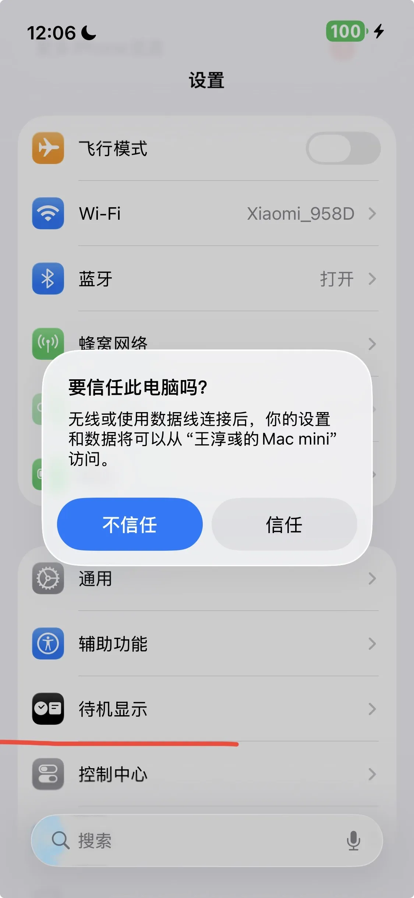
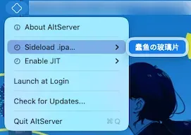
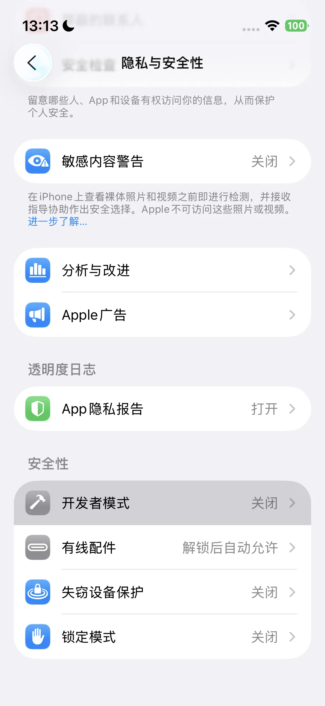
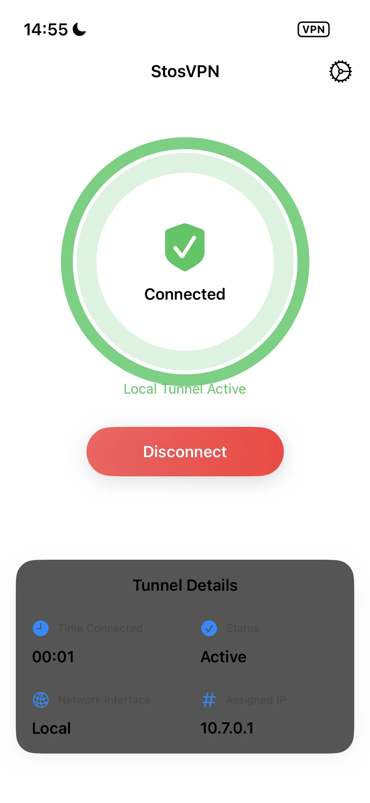
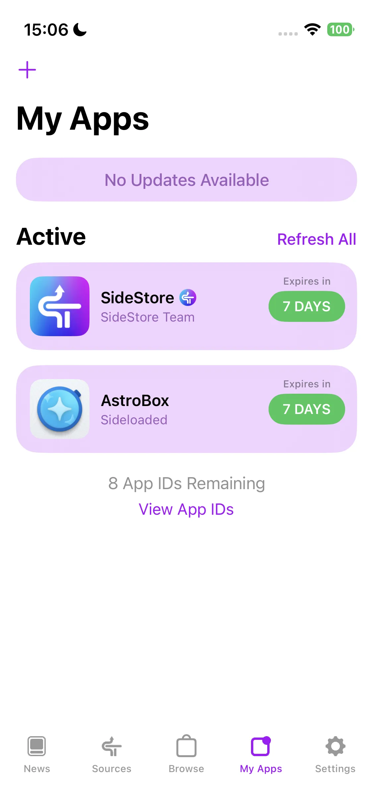

import PurchaseBanner from '@site/src/components/PurchaseBanner';

# AstroBox iOS Version Usage Guide

<PurchaseBanner />

Welcome to AstroBox iOS version! This version was launched later than other platforms due to the greater difficulty in development and adaptation. Thank you for your patience!

To ensure you have the good user experience we expect, unlike other platforms, you have the following special considerations:

## Installation

Due to the nature of the software itself and our use of private APIs, AstroBox will never be available on Apple's official AppStore. Therefore, to install AstroBox on an iOS device, you must have a computer. If you have configured a local sideloading environment such as SideStore / AltStore / LiveContainer / TrollStore, you can directly download the ipa and install it; if not, you can refer to this article (requires a ladder to access) or the tutorial below to configure it, and then install.

It should be noted that the minimum system requirement for the iOS version is 16.5 or above, and for a better experience, it needs to be 17.0 or above.

### Install AstroBox directly on iOS devices using a computer

> The advantage of this method is its simplicity, but the disadvantage is that you need to use a computer for every update.

#### 1. Preparation

First, you need to prepare the following to install AstroBox on your iOS device according to this tutorial:

- iOS device

- Computer

#### 2. Prerequisites Installation

##### Mac

For Mac users, you need to download the following from the AltStore or SideStore official website:

- AltServer

Then unzip `altserver.zip` and drag the unzipped `AltServer.app` file to the "Applications" folder.

The installation process is complete.

##### Windows

For Windows users, you need to download the following from the AltStore or SideStore official website:

- AltServer

Unzip `altserver.zip`, then run `setup.exe` to install AltServer. Windows users need to additionally install non-Microsoft Store versions of iTunes and iCloud compared to Mac users. If the Microsoft Store version is already installed, please uninstall it.

The installation process is complete.

#### 3. Install AstroBox via AltServer

First, you need to connect your iOS device to your Mac via cable and trust your computer on the device.

Next, launch AltServer (right-click to open from the "Applications" folder the first time), hold down the Option key, click the AltServer icon in the top menu bar, and then select `AstroBox.ipa`.

Next, follow the prompts, enter your AppleID and password, and wait for AstroBox to finish installing. The AstroBox icon will appear on your iOS device.

Then go to Settings > General > VPN & Device Management > Select Developer App option > Click Trust.

Then go to Settings > Privacy & Security > Developer Mode, turn on Developer Mode and restart.

The installation is now complete.

:::tip

<mark class="pink">**Note: This installation method may become invalid after seven days (?)**</mark>

:::

### Install AstroBox after establishing a local sideloading environment on an iOS device using a computer

> The advantage of this method is that you can install ipa applications locally on your iOS device without having to use a computer every time. Next, we will demonstrate with SideStore as an example.

#### 1. Preparation

First, you need to prepare the following to install AstroBox on your iOS device according to this tutorial:

- US AppleID (other non-Chinese regions may also work)

- iOS device

- Computer

#### 2. Prerequisites Installation

##### Mac

For Mac users, you need to download the following from the SideStore official website:

- AltServer

- SideStore IPA

- idevice pair

Then open `altserver.zip` and drag the unzipped `AltServer.app` file to the "Applications" folder.

Then open `iDevicePair--macos-universal.dmg` and drag the file to the "Applications" folder.

The installation process is complete.

##### Windows

For Windows users, you need to download the following from the SideStore official website:

- AltServer

- SideStore IPA

- idevice pair

Unzip the `altinstaller.zip` compressed package, then run `setup.exe` to install AltServer. Windows users need to additionally install non-Microsoft Store versions of iTunes and iCloud compared to Mac users. If the Microsoft Store version is already installed, please uninstall it.

Then run `iDevicePair--windows-x86_64.exe` to complete the installation steps.

The installation process is complete.

#### 3. Install SideStore on your device

First, you need to connect your iOS device to your Mac via cable and trust your computer on the device.

Next, launch AltServer (right-click to open from the "Applications" folder the first time), hold down the Option key, click the AltServer icon in the top menu bar, and then select `Sideload.ipa`.

Next, follow the prompts, enter your AppleID and password, and wait for SideStore to finish installing.

Then go to Settings > General > VPN & Device Management > Select Developer App option > Click Trust.

Then go to Settings > Privacy & Security > Developer Mode, turn on Developer Mode and restart.

#### 4. Push pairing file

First, make sure your iOS device has a password set (i.e., screen lock password). With your iOS device connected to your Mac via cable, <mark class="orange">**return to the home screen**</mark> of your iOS device, then open the iDevicePair software (right-click to open from the "Applications" folder the first time).

Then select Device > Click Generate in the software.

After the content below refreshes, click Install in the SideStore tab, and wait for the Success option to appear.

This step is complete.

:::tip

<mark class="pink">Note: If you update or reset your device, your pairing file will become invalid, and you will need to re-complete this step.</mark>

:::

#### 5. Install StosVPN

Next, please log in to an AppleID outside of China (e.g., US region), and download and install StosVPN from the AppleStore.

Next, open the app and click Connect. Every time you want to use SideStore to install, update or refresh AstroBox, you must enable this VPN, and it is recommended to keep it running in the background.

#### 6. Refresh and install the app

Next, open the SideStore app, go to the My Apps tab, click the "X Days" button next to the app, and log in to your Apple account. Then click Refresh.

Select the first option in the pop-up to configure the refresh. Finally, click the plus sign in the upper left corner and select the `AstroBox.ipa` file to install.

### Features

#### About Binding Devices

Due to the particularity of the iOS platform, connecting devices is slightly different from other platforms. Please strictly follow the steps below to bind your device:

1. Ignore related devices in Settings - Bluetooth.

2. Open Settings, log in to your Xiaomi account, get and copy the Authkey (you can also choose other ways to get the Authkey).

3. Open the Devices page, and click Connect Device.

4. After the device appears in the <mark class="orange">**scan results**</mark> below, paste the Authkey.

5. Connection complete.

6. <mark class="pink">**After that, if you open AstroBox again and click reconnect device, and it fails to connect after a long wait, please ignore the related devices in Settings - Bluetooth, and then re-enter and click reconnect.**</mark>

#### About resource installation speed

In terms of basic functions, the iOS version of AstroBox is not much different from other platforms. However, due to changes in the underlying Bluetooth connection method, <mark class="pink">**the speed of installing resources on iOS will always be 3-5 times slower than on other platforms**</mark>.

#### About "Android Camouflage Mode"

If you try to install a quick app, due to Xiaomi's official restrictions, on devices such as Xiaomi Watch S4, REDMI Watch 5, etc., the installed quick app will not be displayed, and cannot be opened through AstroBox's "Quick App Management" function. At this time, you need to switch to "Android Camouflage Mode" to unlock device capabilities.

Mi is striving for excellence, a crucial year. Due to reasons unknown to anyone, when you connect Xiaomi Watch S4, Redmi Watch 5 and other devices to an iOS phone, all quick apps on the device will be hidden by the system, and even newly installed quick apps cannot be "registered" and opened normally.

To deal with this problem, AstroBox provides "Android Camouflage Mode". When this mode is enabled, AstroBox will disguise itself as an Android phone after disconnecting from the current device, and try to reconnect to your wearable device. At this time, the wearable device will mistakenly believe that it has connected to an Android device, thereby restoring the ability to register and display quick apps. After that, even if "Android Camouflage Mode" is turned off and the device is reconnected, AstroBox's "Quick App Management" function can still be used to open these "registered" quick apps.

Please note: Due to the limitations of Xiaomi's system identification mechanism, after an iOS device connects to a wearable device in "Android Camouflage Mode", the connection can only be maintained for a short time, and then it will be detected and disconnected by the system. Therefore, resource management or installation operations cannot be performed in this mode. If you need to use the above functions, you need to turn off "Android Camouflage Mode" and reconnect the device, but this will again trigger the hiding of quick apps.

Whether to enable this mode depends on your actual needs. In short:

- If you want quick apps to be displayed: enable "Android Camouflage Mode" and connect the device;

- If you want to manage or install resources: turn off this mode and reconnect the device.

We recommend that you use it flexibly according to the specific scenario and understand the relevant restrictions.

:::tip

<mark class="pink">**Finally, because the iOS version is difficult to adapt, there are many strange problems, so please try more when using it! Thank you for your understanding!**</mark>

:::note

This tutorial is written by Yulimfish, Searchstars, and others. I (lladlam) am only a third-party re-publisher. The copyright belongs to Yulimfish, Searchstars, and others.

:::