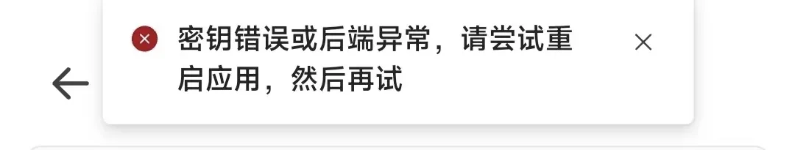

import PurchaseBanner from '@site/src/components/PurchaseBanner';

# Connection Section

<PurchaseBanner />

:::danger
Special attention: If the power level is not displayed on the device page, it means the connection failed! Please check the following items to resolve this issue.
:::

## Q1: Which wristbands are currently supported?

| Model | Status | Notes |
| :--- | :--- | :--- |
| **Xiaomi Band 10** | ✅ Fully supported | |
| **Xiaomi Band 9 Pro** | ✅ Fully supported | |
| **Xiaomi Band 9** | ✅ Fully supported | |
| Xiaomi Band 8 Pro | ❌ Not supported | Outdated device |
| Xiaomi Band 8 | ❌ Not supported | No plans, no clear system information, protocol version not supported |
| Xiaomi Band 7 and older models | ❌ Not supported | Not Xiaomi Vela system |
| **Xiaomi Watch S4 Series** | ✅ Fully supported | |
| **Xiaomi Watch S3 Series** | ✅ Fully supported | |
| Xiaomi Watch S2 Series and older models | ❌ Not supported | Protocol version not supported |
| Xiaomi Watch S1 Pro | ❌ Not supported | Outdated device |
| **Redmi Watch 6** | ✅ Fully supported | |
| **Redmi Watch 5** | ✅ Fully supported | |
| Redmi Watch 4 | ❌ Not supported | Outdated device |
| Redmi Band Series / Xiaomi Band Active Series | ❌ Not supported | |

## 🌟 Q2: How to connect the wristband?

Recommended steps are:

1. Grant AstroBox Bluetooth and location permissions.

2. Log in to your Xiaomi account or obtain an Authkey by other means.

3. Log out of Xiaomi Sports Health on your phone and ensure it is completely closed (or switch to another wearable device).

4. Enter <mark class="orange">**Connect New Device mode**</mark> on the wristband.

5. Go back to the device page and select the device.

6. The Authkey will be automatically prepared for you when logged into your Xiaomi account, just connect directly; if not logged in, just fill in the Authkey.

7. For Windows, you need to click "Allow pairing" in the system Bluetooth settings (a <mark class="orange">**notification may pop up in the lower right corner**</mark>, click it to pair).

## Q3: After connecting the wristband, it shows "Please click confirm on your phone", but nothing happens after clicking. What should I do?

1. Check if AstroBox has been granted Bluetooth and location permissions.

2. Go to Bluetooth settings and ignore the device.

3. Reconnect the device in Xiaomi Sports Health.

4. Deeply close and stop Xiaomi Sports Health.

5. The wristband enters the state of connecting to a new phone.

6. Go to AstroBox settings, and resynchronize the Authkey through your Xiaomi account.

7. Go to the connect device page and reconnect.

## Q4: How to get Authkey?

You can directly log in to your Xiaomi account in the app settings - Sync Device to get it with one click. Afterwards, you can see all devices and their Authkeys on the connect device page. You can also get the Authkey by checking the log in Xiaomi Sports Health.

## Q5: After logging in on an iOS device, why doesn't the connect device page automatically display the devices in the account?

Due to the particularity of the iOS platform, we have designed new connection steps for iOS devices. Please refer to this document.

## 🌟 Q6: Why can't I connect to the wristband/the wristband disconnects after a few seconds?

If you have any connection problems, please check:

1. Whether Xiaomi Sports Health is <mark class="orange">**completely cleared from the background**</mark> (or whether the "nearby devices" permission of "Xiaomi Sports Health" is turned off).

2. Whether <mark class="orange">**other interfering items such as watch face customization tools, Notify For Xiaomi, GadgetBridge, etc. are all turned off**</mark>, and if necessary, you can uninstall them directly. (澎湃OS2 users can try adjusting "Interconnection Service" to prevent connection grabbing)

3. Whether the wristband has entered <mark class="orange">**Connect New Device mode**</mark>.

4. Whether AstroBox has been granted <mark class="orange">**"nearby devices", "Bluetooth", "location acquisition" permissions**</mark>.

5. For computers, please check if there is a <mark class="orange">**Bluetooth module (4.0+)**</mark>, and check if you have <mark class="orange">**clicked confirm in computer settings and wristband clicked confirm**</mark>.

6. Please try to <mark class="orange">**"ignore" your wristband**</mark> in the system Bluetooth settings, and then try to reconnect <mark class="orange">**(iOS users especially need to try this step)**</mark>. For Windows, due to system characteristics, you can restart the computer and try again.

7. If there is a <mark class="orange">**new version of the Bluetooth firmware**</mark>, please <mark class="orange">**update it yourself**</mark> in the system settings.

8. Is the Android version <mark class="orange">**13 or above**</mark>.

If the problem still cannot be solved, please restart the wristband and app multiple times.

## 🌟 Q7: What to do if "Key error or backend abnormal" is displayed?

First, check if your device can be used in AstroBox. Click [here](#q1-which-wristbands-are-currently-supported) for details.

If the device is in the supported list, please check if your Authkey is correct. Some devices update the Authkey frequently, so you need to go back to Sports Health to reconnect and update, then put the wristband into connect new phone state, and then enter AstroBox to log in to your Xiaomi account to get it.

## Q8: Displays "Connection failed...SPP...LOCATION permission"

Please check if you have granted AstroBox Bluetooth and location permissions.

:::note

This tutorial is written by Yulimfish, Chuan., wuhaiqi, and others. I (lladlam) am only a third-party re-publisher. The copyright belongs to Yulimfish, Chuan., wuhaiqi, and others.

:::