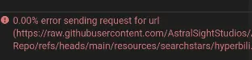
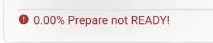
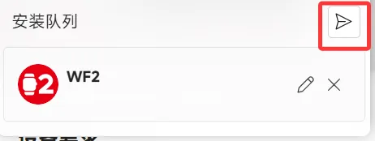

import PurchaseBanner from '@site/src/components/PurchaseBanner';

# Resource Download and Installation

<PurchaseBanner />

## Q1: Why is the BandBBS section on the homepage empty/displaying "No BandBBS account"?

You have not logged in to your Mi Forum account in the settings.

## Q2: After clicking to download BandBBS resources, why don't they automatically download like official sources?

After clicking to download BandBBS resources, you need to select the file from the dropdown menu before downloading and installing. Please confirm whether the resource's adapted wearable device model is consistent with your device model before downloading.

## Q3: Resource displays 404 or "resource not found"

This resource does not exist, please contact the resource author to resolve.

## Q4: What to do if "error sending request for url" appears?

You can try switching the CDN in the settings and restarting the application. If neither works, please try magic.

## Q5: What to do if "No devices are connected" / "deadline has elapsed" appears?

Please confirm whether the wristband is connected, go back to the homepage to confirm the current connection status, and it is recommended to restart the application multiple times and try again.

## Q6: What to do if "channel closed" appears?

It may be that the connection between the wristband and AB has been disconnected. You can try to reconnect at this time;

It may also be that the Authkey is incorrect. This is because the Authkey will change after a factory reset/at a random time. Reconnect to Xiaomi Sports Health, and then log in to your Xiaomi account in AstroBox to synchronize the latest Authkey.

## Q7: What to do if "Prepare not READY!" appears?

Please ensure that the wristband has sufficient storage space or power, then restart the wristband. If it still doesn't work, click the edit button next to the resource and change any ID.

For Redmi Watch 5 eSIM, please downgrade the version, as the system restricts app installation.

## Q8: What to do if "Timeout waiting for protokey" appears?

Please restart AstroBox and the wristband and try again.

## Q9: What to do if "failed to open file" appears?

1. Please check if your file is completely downloaded.

2. Check if AstroBox has been granted sufficient file read permissions.

## Q10: What to do if "failed to get metadata of path" appears?

You can check if the app is installed on the wristband. Most likely it's a bug in AstroBox itself.

## Q11: What to do if "url is not a valid path" appears?

Please check if your file format is correct, usually bin or rpk (quick app).

## 🌟 Q12: Can firmware installation be used?

:::danger

<mark class="pink">It is best not to use Android phones to transfer firmware, as it is prone to packet loss. It is recommended to try with other devices. For Android firmware installation, it is recommended to go to Notify For Xiaomi next door. During firmware installation, please do not perform any operations on the phone or wristband! Do not install firmware of different models or regions on the wristband! Firmware installation is a very dangerous operation, and the AstroBox team will not be responsible for any consequences! If you want to try firmware installation, it is recommended to change the packet interval in the settings to 10.</mark>

:::

## Q13: What to do if I download and install two or more watch faces, but the device only displays one of them?

This problem is caused by resource developers not using the same watch face ID, resulting in resource replacement. Please follow the steps below:

1. Turn off the automatic installation function in the settings.

2. Download/install local resources, and click the "pencil" icon in the red circle below in the queue.

3. In the pop-up window, enter any 9/12 digit number, or click the "random" icon in the red circle, then click the modify button below.

4. Click the button shown in the red circle to send the watch face to the device.

:::note

This tutorial is written by Yulimfish, Chuan., wuhaiqi, and others. I (lladlam) am only a third-party re-publisher. The copyright belongs to Yulimfish, Chuan., wuhaiqi, and others.

:::
