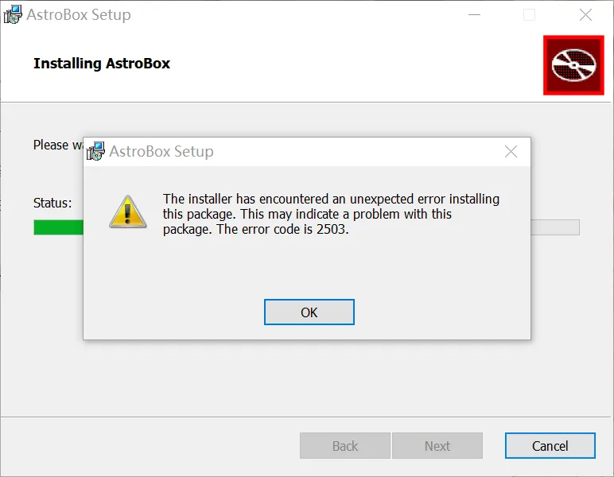
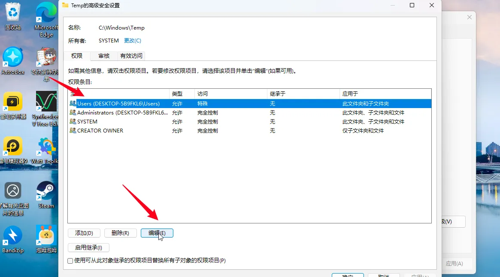
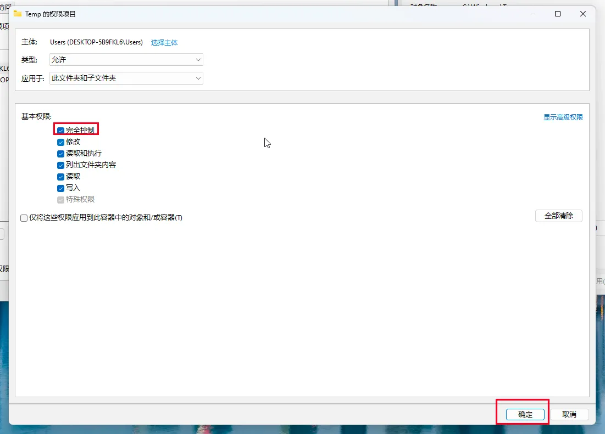

import PurchaseBanner from '@site/src/components/PurchaseBanner';

# Getting Started / Installation

<PurchaseBanner />

## When installing on a phone, it shows "Problem parsing package"?

Please check if your Android version is <mark>**Android 10 or above**</mark>. Versions below 13 have poor stability. <mark>**Android versions 13 and above are recommended**</mark>.

## Q1: When opening on Mac, it shows "'AstroBox.app' is damaged and cannot be opened. You should move it to the trash."?

Execute the following command in the terminal and enter your password.

```bash
sudo xattr -r -d com.apple.quarantine /Applications/AstroBox.app
```

## Q2: When installing on Windows, it shows error code 2502/2503?



First, go to the official website to re-download the installer to check if the installer was corrupted during the download process.

If it still doesn't work, it's an MSI installation permission issue. Please follow the steps below:

<details>
	<summary>Click here to expand/collapse content</summary>
	
	1. Right-click this folder, and click Properties.
	
	
	
	2. In the Security tab, select the current user, and click Edit.

	

	
	
	3. Select Full control and click OK.
	
	
	
	4. Go back to the original page and click Apply.
	
	
	
	Click the left arrow to expand.
	1. Right-click this folder, and click Properties.
	
	2. In the Security tab, select the current user, and click Edit.
	
	3. Select Full control and click OK.
	
	4. Go back to the original page and click Apply.
	
	Then you can restart the installer and try to install it again.
</details>

## Q3: Slow homepage loading speed/loading failure?

You can try <mark>changing the CDN</mark> in the settings and restarting. It is recommended to change to ghp; if you can accept always using a proxy, you can directly change to raw.

Alternatively, you can try going to the Wi-Fi list, opening the settings on the right, IP settings, changing to static, changing DNS1 to 114.114.114.114 or 223.5.5.5 (this can be written to DNS2), DNS2 can be changed to 8.8.8.8, then return to reconnect and refresh again!

## 🌟 Q4: Why is the homepage blank like this/settings page unscrollable?

The characteristics of this blank screen are:

1. Banner can be displayed.

2. Only "Has been thoroughly investigated" is displayed under the application list.

3. And your settings page also cannot be scrolled.

If the above characteristics are met, you can try this method.

According to feedback from group members, this problem is most likely due to an outdated system Webview version. Please update your Webview to 115+.

You can try downloading from this link, prioritizing the shared library version: https://www.123pan.cn/s/Zg85Vv-Fte8.html

If the installation fails, you can check the Android version or disable system optimization in developer options (e.g., MIUI optimization).

If it's a Huawei phone, and it still doesn't work after installation, you can try to find and install the Huawei version of Webview from the link above, and then go to Developer Options - Webview implementation to switch. Try both.

## Q5: Animation lag/abnormality?

It is normal for this problem to occur on mobile phones. A chip above Snapdragon 8 Gen 1 is required to display animations well.

## ~~Q6: Windows 11 device updated to 1.5.0 homepage blank/nothing clickable~~

<mark class="pink">Fixed in version 1.5.1, please update to the latest version.</mark>

---
:::tip

Different systems have different version numbers, pay attention to distinguish them.

:::

---

## ~~Q7: HarmonyOS cannot be used/installed~~

<mark class="pink">Available in version 1.2.0, as long as your Android version is greater than or equal to 10.</mark>

~~HarmonyOS with AOSP version greater than or equal to 13 is required. If it's HarmonyOS Next, you can directly try ZhuoYiTong. Currently, most Huawei models that have been tried cannot be used. You can try, but it's likely it won't work.~~

## ~~Q8: Cannot click "Agree" on the protocol page?~~

<mark class="pink">This issue has been fixed in version 1.0.1.</mark>

~~First, please make sure you have read the protocol completely and <mark>scrolled to the bottom</mark>. If you still cannot click, please <mark>hang in a small window and then click</mark>. This issue will be fixed later.~~

:::note

This tutorial is written by Yulimfish, Chuan., wuhaiqi, and others. I (lladlam) am only a third-party re-publisher. The copyright belongs to Yulimfish, Chuan., wuhaiqi, and others.

:::