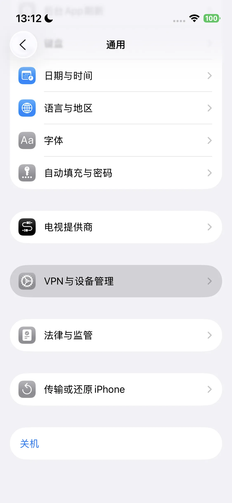
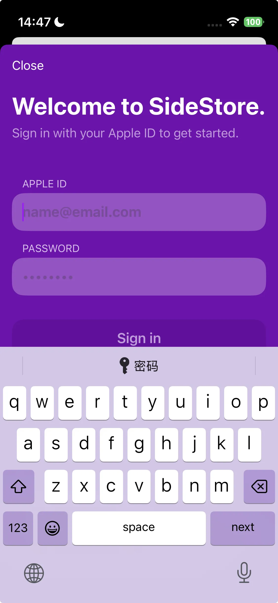
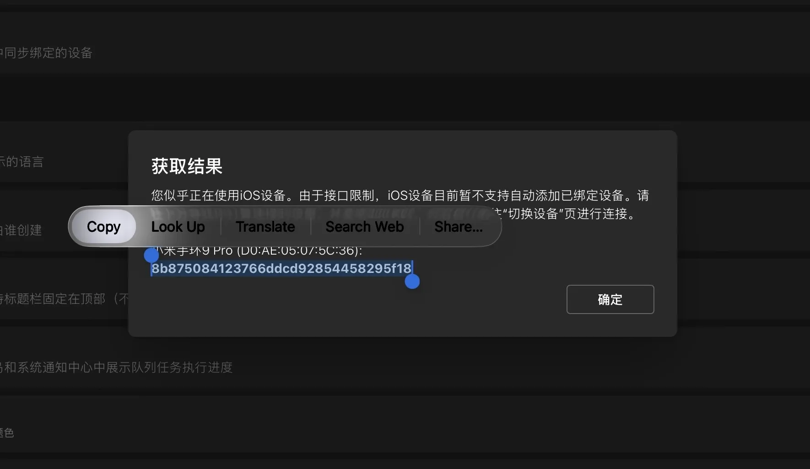

import PurchaseBanner from '@site/src/components/PurchaseBanner';

# AstroBox iOS版 利用上の注意

<PurchaseBanner />

AstroBox iOS版をご利用いただきありがとうございます！本バージョンは開発と適応の難易度が高かったため、他プラットフォームよりもリリースが遅れました。皆様のご理解と忍耐に感謝いたします。

私たちが意図した良好なユーザー体験を提供するため、他プラットフォームとは異なり、以下の特殊な注意事項をご確認ください：

## インストール

ソフトウェア自体の性質およびプライベートAPIの使用により、AstroBoxがApple公式のAppStoreに掲載されることはありません。そのため、iOSデバイスにAstroBoxをインストールするにはパソコンが必要です。すでにSideStore / AltStore / LiveContainer / TrollStore などのローカルサイドロード環境を設定済みの場合は、ipaファイルを直接ダウンロードしてインストールできます。設定していない場合は、こちらの記事（要VPN）または以下のチュートリアルを参考に設定してからインストールしてください。

なお、iOS版の最低システム要件は16.5以上ですが、より良い体験のためには17.0以上を推奨します。

### パソコンを使って直接iOSデバイスにAstroBoxをインストールする

> この方法の利点は非常に簡単であることですが、欠点は更新のたびにパソコンが必要になることです。

#### 1. 準備

本チュートリアルに従ってiOSデバイスにAstroBoxをインストールするには、以下の準備が必要です：

- iOSデバイス
- パソコン

#### 2. 前置ソフトウェアのインストール

##### Mac

Macユーザーは、AltStoreまたはSideStoreの公式サイトから以下をダウンロードする必要があります：

- AltServer

次に `altserver.zip` を解凍し、解凍された `AltServer.app` ファイルを「アプリケーション」フォルダにドラッグ＆ドロップします。

これでインストールプロセスは完了です。

##### Windows

Windowsユーザーは、AltStoreまたはSideStoreの公式サイトから以下をダウンロードする必要があります：

- AltServer

`altserver.zip` を解凍し、`setup.exe` を実行してAltServerをインストールします。WindowsユーザーはMacユーザーと異なり、Microsoft Store版ではないiTunesとiCloudを別途インストールする必要があります。すでにMicrosoft Store版をインストールしている場合は、アンインストールしてください。

これでインストールプロセスは完了です。

#### 3. AltServer経由でAstroBoxをインストールする

まず、iOSデバイスをケーブルでMacに接続し、デバイス上でパソコンを信頼してください。

次に、AltServerを起動します（初回起動時は「アプリケーション」フォルダ内で右クリックして「開く」を選択してください）。Optionキーを押しながら、上部メニューバーのAltServerアイコンをクリックし、`AstroBox.ipa` を選択します。

その後、プロンプトに従ってApple IDとパスワードを入力し、AstroBoxのインストール完了を待ちます。iOSデバイスにAstroBoxのアイコンが表示されます。

続いて、「設定」 > 「一般」 > 「VPNとデバイス管理」 > 「デベロッパApp」オプションを選択 > 「信頼」をクリックします。

次に、「設定」 > 「プライバシーとセキュリティ」 > 「デベロッパモード」へ進み、デベロッパモードをオンにして再起動します。

これでインストールは完了です。

:::tip

<mark class="pink">**注意：このインストール方法は7日後に無効になる可能性があります（？）。**</mark>

:::

### パソコンでiOSデバイスにローカルサイドロード環境を構築してからAstroBoxをインストールする

> この方法の利点は、iOSデバイス上でローカルにipaアプリをインストールでき、毎回パソコンを使う必要がなくなることです。ここではSideStoreを例に説明します。

#### 1. 準備

本チュートリアルに従ってiOSデバイスにAstroBoxをインストールするには、以下の準備が必要です：

- 米国などの海外Apple ID
- iOSデバイス
- パソコン

#### 2. 前置ソフトウェアのインストール

##### Mac

Macユーザーは、SideStore公式サイトから以下をダウンロードする必要があります：

- AltServer
- SideStore IPA
- idevice pair

次に `altserver.zip` を開き、解凍された `AltServer.app` ファイルを「アプリケーション」フォルダにドラッグ＆ドロップします。

そして `iDevicePair--macos-universal.dmg` を開き、ファイルを「アプリケーション」フォルダにドラッグ＆ドロップします。

これでインストールプロセスは完了です。

##### Windows

Windowsユーザーは、SideStore公式サイトから以下をダウンロードする必要があります：

- AltServer
- SideStore IPA
- idevice pair

`altinstaller.zip` を解凍し、`setup.exe` を実行してAltServerをインストールします。WindowsユーザーはMacユーザーと異なり、Microsoft Store版ではないiTunesとiCloudを別途インストールする必要があります。すでにMicrosoft Store版をインストールしている場合は、アンインストールしてください。

次に `iDevicePair--windows-x86_64.exe` を実行し、インストール手順を完了させます。

これでインストールプロセスは完了です。

#### 3. デバイスにSideStoreをインストールする

まず、iOSデバイスをケーブルでMacに接続し、デバイス上でパソコンを信頼してください。

次に、AltServerを起動します（初回起動時は右クリックで開く）。Optionキーを押しながらメニューバーのアイコンをクリックし、`Sideload.ipa` を選択します。

プロンプトに従い、Apple IDとパスワードを入力して、SideStoreのインストール完了を待ちます。

続いて、「設定」 > 「一般」 > 「VPNとデバイス管理」 > 「デベロッパApp」オプションを選択 > 「信頼」をクリックします。

次に、「設定」 > 「プライバシーとセキュリティ」 > 「デベロッパモード」へ進み、デベロッパモードをオンにして再起動します。

#### 4. ペアリングファイルのプッシュ

まず、iOSデバイスにパスコード（ロック画面のパスワード）が設定されていることを確認してください。iOSデバイスをケーブルでMacに接続した状態で、デバイスを<mark class="orange">**ホーム画面に戻し**</mark>、先ほどのiDevicePairソフトウェアを開きます（初回は右クリックで開く）。

ソフトウェアでデバイスを選択し、 「Generate」 をクリックします。

下の内容が更新されるのを待ち、SideStoreタブで 「Install」 をクリックして 「Success」 と表示されるまで待ちます。

このステップは完了です。

:::tip

<mark class="pink">注意：デバイスをアップデートまたはリセットすると、ペアリングファイルが無効になるため、このステップを再度行う必要があります。</mark>

:::

#### 5. StosVPNのインストール

次に、中国本土以外のApple ID（米国など）にログインし、App Storeから StosVPN をダウンロードしてインストールします。

アプリを開き、「接続」をクリックします。SideStoreを使用してAstroBoxをインストール、更新、または更新（リフレッシュ）する場合は、必ずこのVPNを有効にする必要があります。バックグラウンドで常にオンにしておくことをお勧めします。

#### 6. アプリのリフレッシュとインストール

次に、SideStoreアプリを開き、「My Apps」タブに入ります。アプリの横にある「X Days」ボタンをクリックし、Appleアカウントにログインします。その後、リフレッシュ（更新）をクリックします。

ポップアップ表示される選択肢から一番上のものを選ぶと、リフレッシュの設定が完了します。最後に左上のプラス（+）ボタンをクリックし、`AstroBox.ipa` ファイルを選択すればインストール完了です。

### 機能

#### デバイスのバインドについて

iOSプラットフォームの特殊性により、デバイス接続は他のプラットフォームと少し異なります。以下の順序で厳密にデバイスをバインドしてください：

1. 「設定」 - 「Bluetooth」で、該当するデバイスを解除（登録解除）します。
2. 設定を開き、Xiaomiアカウントにログインして Authkey を取得・コピーします（他の方法で取得しても構いません）。

3. デバイスページを開き、「デバイスを接続」をクリックします。
4. 下の<mark class="orange">**スキャン結果**</mark>にデバイスが表示されるのを待ってから、Authkeyを貼り付けます。

5. 接続完了。
6. <mark class="pink">**今後AstroBoxを再度開いた際、再接続をクリックして長時間待っても接続できない場合は、「設定」 - 「Bluetooth」でデバイスを解除してから、再度再接続をクリックしてください。**</mark>

#### リソースのインストール速度について

基本機能において、iOS版AstroBoxの特性は他プラットフォームと大きな違いはありません。しかし、Bluetoothの基盤となる接続方式の変化により、<mark class="pink">**iOSでのリソースインストール速度は、他プラットフォームより常に3〜5倍遅くなります。**</mark>

#### 「Android偽装モード」について

クイックアプリ（快应用）をインストールしようとする場合、Xiaomi公式の制限により、Xiaomi Watch S4やREDMI Watch 5などのデバイスでは、インストールしたクイックアプリが表示されず、AstroBoxの「クイックアプリ管理」機能からも開くことができません。この場合、デバイス機能をアンロックするために「Android偽装モード」に切り替える必要があります。

Xiaomiのハイエンド戦略が重要な時期にありますが、理由は不明ながら、Xiaomi Watch S4やRedmi Watch 5などをiOSに接続すると、デバイス上のすべてのクイックアプリがシステムによって非表示にされ、新しくインストールしたアプリも正常に「登録」されず開けなくなります。

これに対処するため、AstroBoxは「Android偽装モード」を提供しています。このモードを有効にすると、AstroBoxは現在の接続を切断した後、自身をAndroidスマートフォンに偽装してウェアラブルデバイスへの再接続を試みます。この時、デバイスはAndroidに接続されたと誤認し、クイックアプリの登録と表示機能が回復します。その後、「Android偽装モード」をオフにして再接続しても、AstroBoxの「クイックアプリ管理」機能を使って、これらの「登録済み」クイックアプリを開くことができます。

注意：Xiaomiシステムの認識メカニズムの制限により、iOSデバイスが「Android偽装モード」で接続した場合、短時間しか接続を維持できず、すぐにシステムに見破られて切断されます。そのため、このモードではリソースの管理やインストール操作は行えません。これらの機能を使用するには、モードをオフにして再接続する必要がありますが、そうすると再びクイックアプリが非表示になります。

このモードを使用するかどうかは、実際のニーズに合わせて判断してください。簡単に言うと：

- クイックアプリを表示させたい場合：「Android偽装モード」を有効にして接続。
- リソースを管理・インストールしたい場合：このモードを無効にして再接続。

シーンに合わせて柔軟に使用し、制限事項をご理解いただくようお願いいたします。

:::tip

<mark class="pink">**最後に、iOS版は適応が困難で奇妙な問題が多く発生します。使用中に問題が起きた場合は、色々と試してみてください！ご理解ありがとうございます！**</mark>

:::note

本チュートリアルはYulimfish、Searchstars氏らによって作成されました。私（lladlam）はサードパーティによる転載であり、著作権はYulimfish、Searchstars氏らに帰属します。

:::