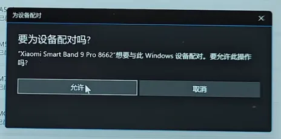
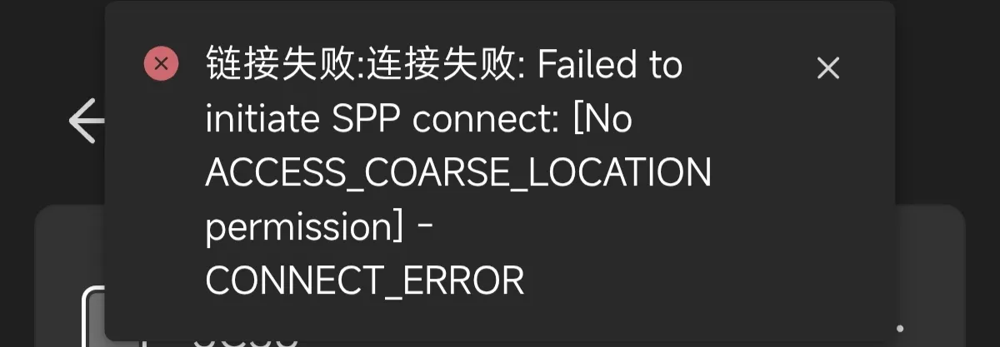

import PurchaseBanner from '@site/src/components/PurchaseBanner';

# 接続編

<PurchaseBanner />

:::danger

重要：デバイスページにバッテリー残量が表示されない場合は、接続に失敗しています。以下の事項を確認して解決してください。

:::

## Q1：現在、どのスマートバンドが使用可能ですか？

| モデル | ステータス | 備考 |
| :--- | :--- | :--- |
| **Xiaomi Smart Band 10** | ✅ 完全対応 | |
| **Xiaomi Smart Band 9 Pro** | ✅ 完全対応 | |
| **Xiaomi Smart Band 9** | ✅ 完全対応 | |
| Xiaomi Smart Band 8 Pro | ❌ 非対応 | 旧型デバイス |
| Xiaomi Smart Band 8 | ❌ 非対応 | 計画なし、システム詳細不明、プロトコルバージョン非対応 |
| Xiaomi Smart Band 7 以前 | ❌ 非対応 | Xiaomi Vela システムではない |
| **Xiaomi Watch S4 シリーズ** | ✅ 完全対応 | |
| **Xiaomi Watch S3 シリーズ** | ✅ 完全対応 | |
| Xiaomi Watch S2 以前 | ❌ 非対応 | プロトコルバージョン非対応 |
| Xiaomi Watch S1 Pro | ❌ 非対応 | 旧型デバイス |
| **Redmi Watch 6** | ✅ 完全対応 | |
| **Redmi Watch 5** | ✅ 完全対応 | |
| Redmi Watch 4 | ❌ 非対応 | 旧型デバイス |
| Redmi Band シリーズ / Xiaomi Band Active シリーズ | ❌ 非対応 | |

## 🌟 Q2：バンドを接続する方法は？

推奨される手順は以下の通りです：

1. AstroBox に Bluetooth と位置情報の権限を許可します。

2. Xiaomi アカウントにログインするか、他の方法で Authkey を取得します。

3. スマートフォンで「Mi Fitness」アプリを終了し、完全に閉じていることを確認します（または別のウェアラブルデバイスに切り替えます）。

4. バンド側で<mark class="orange">**「新しいデバイスを接続」モード**</mark>に入ります。

5. デバイスページに戻り、デバイスを選択します。

6. Xiaomi アカウントにログインしている状態であれば、Authkey は自動的に準備されます。そのまま接続してください。ログインしていない場合は、Authkey を直接入力してください。

7. Windows の場合は、システムの Bluetooth 設定でペアリングの許可をクリックする必要があります（<mark class="orange">**右下に通知が表示される**</mark>ことがあるので、それをクリックしてペアリングしてください）。

## Q3：バンドをリンクした後「スマートフォンで確認してください」と表示され、クリックしても反応がない場合は？

1. AstroBox に Bluetooth と位置情報の権限を許可しているか確認してください。

2. Bluetooth 設定でデバイスの登録を解除（解除/忘れる）してください。

3. Mi Fitness に入り、デバイスを再接続してください。

4. Mi Fitness を完全に終了（強制停止）させてください。

5. バンドを「新しいスマートフォンに接続」の状態にします。

6. AstroBox の設定に入り、Xiaomi アカウントを通じて Authkey を再度同期します。

7. 接続デバイスページに入り、再度接続を試みてください。

## Q4：Authkey を取得する方法は？
アプリ設定の「デバイス同期」で Xiaomi アカウントにログインすることで、ワンクリックで取得できます。その後、接続デバイスページですべてのデバイスとその Authkey を確認できます。また、Mi Fitness のログから Authkey を見つけることも可能です。

## Q5：iOS デバイスでログイン後、接続デバイスページにアカウント内のデバイスが自動表示されないのはなぜですか？

iOS プラットフォームの特殊性により、iOS デバイス用に新しい接続手順を設計しました。こちらのドキュメントを参照してください。

## 🌟 Q6：なぜバンドに接続できない、または数秒で切断されるのですか？

接続に問題がある場合は、以下を確認してください：

1. Mi Fitness が<mark class="orange">**バックグラウンドから完全に消去**</mark>されているか（または Mi Fitness の「付近のデバイス」権限がオフになっているか）。

2. ウォッチフェイスカスタマイズツール、Notify For Xiaomi、GadgetBridge などの<mark class="orange">**他の干渉項目の権限がすべてオフ**</mark>になっているか。必要であればアンインストールしてください。（HyperOS 2 ユーザーは「相互接続サービス」を調整して接続の奪い合いを防ぐことができます）。

3. バンドが<mark class="orange">**「新しいデバイスを接続」モード**</mark>に入っているか。

4. AstroBox に<mark class="orange">**「付近のデバイス」、「Bluetooth」、「位置情報」の権限**</mark>を与えているか。

5. PC の場合は<mark class="orange">**Bluetooth モジュール (4.0+)**</mark> があるか確認し、<mark class="orange">**PC の設定で確認をクリックし、バンド側でも確認をクリック**</mark>したか確認してください。

6. システムの Bluetooth 設定でバンドを<mark class="orange">**「登録解除（忘れる）」**</mark>してから、再接続を試みてください<mark class="orange">**（特に iOS ユーザーはこの手順が必要です）**</mark>。Windows はシステムの特性上、PC を再起動してから試してください。

7. <mark class="orange">**Bluetooth ファームウェアの更新**</mark>がある場合は、システム設定で<mark class="orange">**自身で更新**</mark>してください。

8. Android のバージョンが<mark class="orange">**13 以上**</mark>であるか。

それでも解決しない場合は、バンドとアプリを何度も再起動してください。

## 🌟 Q7：「キーエラーまたはバックエンド異常（密钥错误或后端异常）」と表示される場合は？

まず、お使いのデバイスが AstroBox で使用可能か確認してください。詳細は[こちら](#q1目前什么手环可以使用)をクリック。

デバイスがサポートリストにある場合は、Authkey が正しいか確認してください。一部のデバイスは頻繁に Authkey を更新するため、Mi Fitness に戻って再度接続・更新した後、バンドを「新しいスマートフォンに接続」の状態にし、再度 AstroBox で Xiaomi アカウントにログインして取得し直す必要があります。

## Q8：「接続失敗…SPP…LOCATION permission」と表示される場合は？

AstroBox に Bluetooth と位置情報の権限を許可しているか確認してください。

:::note

このチュートリアルは Yulimfish、川.、wuhaiqi らによって作成されました。本人（lladlam）はサードパーティとしての転載のみを行っており、著作権は Yulimfish、川.、wuhaiqi らに帰属します。

:::