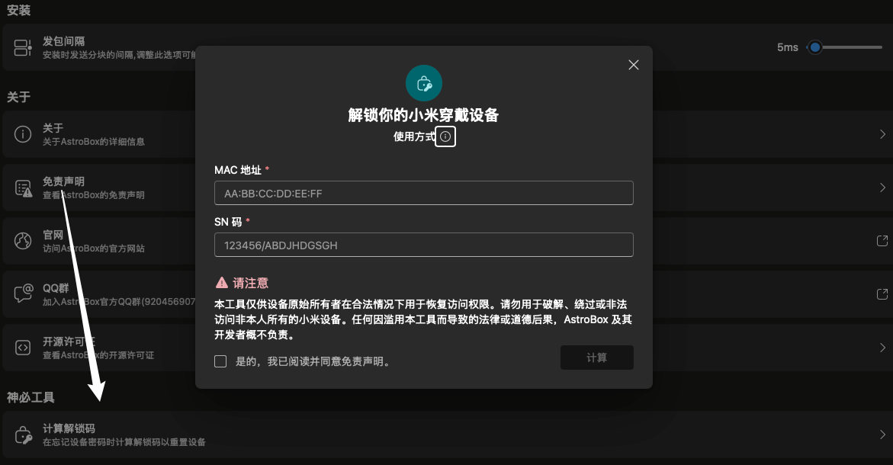

import PurchaseBanner from '@site/src/components/PurchaseBanner';

# 機能篇

<PurchaseBanner />

## Q1：なぜプラグインマーケットが空で使えないのですか？

Android 版は 1.0.1 以降でプラグインマーケットが実装されています。依然として空白の場合は、ネットワークを確認してください。

## Q2：ロック解除コードの計算とはどのような機能ですか？

この機能は、バンドのパスワードを忘れた場合に使用します。むやみに試さないでください。解除コードを取得して入力すると、バンドが工場出荷時設定にリセットされます。

:::note

このチュートリアルは Yulimfish、川.、wuhaiqi らによって作成されました。本人（lladlam）はサードパーティとしての転載のみを行っており、著作権は Yulimfish、川.、wuhaiqi らに帰属します。

:::