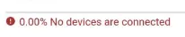
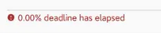
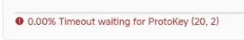
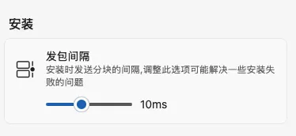
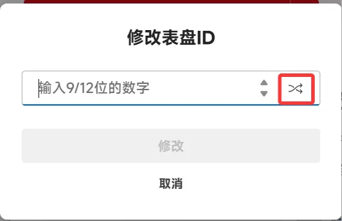

import PurchaseBanner from '@site/src/components/PurchaseBanner';

# ダウンロード・インストール・リソース編

<PurchaseBanner />

## Q1：ホームページの BandBBS 項目が空白、または「No BandBBS account」と表示されるのはなぜ？

設定で BandBBS（米坛）アカウントにログインしていません。

## Q2：BandBBS のリソースをクリックしても公式ソースのように自動ダウンロードされない？

BandBBS のリソースは、クリックした後にプルダウンメニューからファイルを選択してダウンロード・インストールする必要があります。ダウンロード前に、リソースが対応しているウェアラブルデバイスのモデルがお使いのデバイスと一致しているか、自身で確認してください。

## Q3：リソースが 404 または「resource not found」と表示される

このリソースは存在しません。リソースの作者に連絡して解決してください。

## Q4：「error sending request for url」と表示される場合は？

設定で CDN を切り替えてアプリを再起動してみてください。どれもダメな場合は、プロキシ（魔法）を試してください。

## Q5：「No devices are connected」または「deadline has elapsed」と表示される場合は？

バンドが接続されているか確認してください。ホームページに戻って現在の接続状態を確認し、アプリの再起動や数回の再試行をお勧めします。

## Q6：「channel closed」と表示される場合は？

バンドと AstroBox の接続が切断された可能性があります。この場合は再接続を試みてください。

または、Authkey が間違っている可能性があります。これは工場出荷時設定へのリセット後や、ランダムなタイミングで Authkey が変更されるためです。一度 Mi Fitness に再接続してから、AstroBox で Xiaomi アカウントにログインして最新の Authkey を同期してください。

## Q7：「Prepare not READY!」と表示される場合は？

バンドに十分なストレージ空き容量またはバッテリー残量があることを確認し、バンドを再起動してください。それでもダメな場合は、リソースの横にある編集ボタンをクリックし、ID を適当に変更してみてください。

Redmi Watch 5 eSIM の場合は、バージョンをダウングレードしてください。システムによりアプリのインストールが制限されています。

## Q8：「Timeout waiting for protokey」と表示される場合は？

AstroBox とバンドを再起動して、再度試してください。

## Q9：「failed to open file」と表示される場合は？

1. ファイルが完全にダウンロードされているか確認してください。

2. AstroBox に十分なファイル読み取り権限が与えられているか確認してください。

## Q10：「failed to get metadata of path」と表示される場合は？

バンドにそのアプリがインストールされているか確認してください。高確率で AstroBox 自体のバグです。

## Q11：「url is not a valid path」と表示される場合は？

ファイル形式が正しいか確認してください。通常は .bin または .rpk（クイックアプリ）です。

## 🌟 Q12：ファームウェアのインストールは使えますか？

:::danger

<mark class="pink">Android スマートフォンでファームウェアを転送するのは避けてください。パケットロスが発生しやすいため、他のデバイスで試すことをお勧めします。Android でのファームウェアインストール機能については、隣の「Notify For Xiaomi」の使用を検討してください。ファームウェアのインストール中は、スマートフォンやバンドを一切操作しないでください！同一モデル、同一地域ではないファームウェアをバンドにインストールしないでください！ファームウェアのインストールは非常に危険な行為であり、いかなる結果に対しても AstroBox チームは責任を負いません！ファームウェアのインストールを試す場合は、設定の「パケット送信間隔（发包间隔）」を 10 に変更することをお勧めします。</mark>

:::

## Q13：2 つ以上のウォッチフェイスをダウンロード・インストールしたが、デバイスに 1 つしか表示されない場合は？

この問題は、リソース開発者が同じウォッチフェイス ID を使用したためにリソースが上書きされたことが原因です。以下の手順で操作してください。

1. 設定で自動インストール機能をオフにします。

2. ローカルリソースをダウンロード/インストールし、キュー内の下の赤丸で囲った「ペン」アイコンをクリックします。

3. ポップアップで 9 桁または 12 桁の数字を適当に入力するか、赤丸の「ランダム」アイコンをクリックし、下の「修正」ボタンをクリックします。

4. 赤丸で示されたボタンをクリックして、ウォッチフェイスをデバイスに送信します。

:::note

このチュートリアルは Yulimfish、川.、wuhaiqi らによって作成されました。本人（lladlam）はサードパーティとしての転載のみを行っており、著作権は Yulimfish、川.、wuhaiqi らに帰属します。

:::