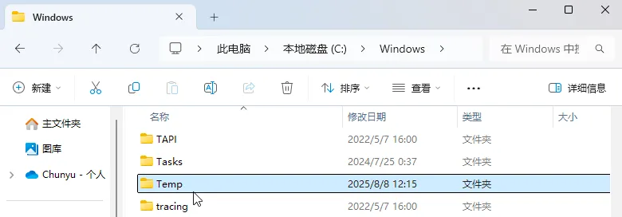
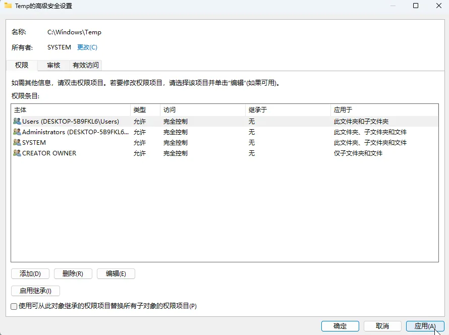

import PurchaseBanner from '@site/src/components/PurchaseBanner';

# 入門/インストール編

<PurchaseBanner />

## 携帯電話へのインストール時に「パッケージの解析中に問題が発生しました」と表示される場合は？

Android のバージョンが<mark>**Android 10 以上**</mark>であることを確認してください。13 未満のバージョンは安定性が低いため、<mark>**Android 13 以上の使用を推奨**</mark>します。

## Q1：Mac で開くと「『AstroBox.app』は壊れているため開けません。ゴミ箱に入れる必要があります。」と表示される場合は？

ターミナルで以下のコマンドを実行し、パスワードを入力してください。

```bash
sudo xattr -r -d com.apple.quarantine /Applications/AstroBox.app
```

## Q2：Windows でのインストール時にエラーコード 2502/2503 が表示される場合は？


まず公式サイトからインストールパッケージを再ダウンロードし、ダウンロード中にファイルが破損していないか確認してください。

解決しない場合は、msi のインストール権限の問題です。<mark class="orange">まず、メインプログラムを解凍してから実行しているか確認してください。解凍していない場合は解凍してから再試行してください</mark>。それでも解決しない場合は、以下の手順に従ってください。

<details>
	<summary>ここをクリックして内容を展開/折りたたむ</summary>
	
	1. このフォルダを右クリックし、「プロパティ」をクリックします。
	
	
	
	2. 「セキュリティ」タブで現在のユーザーを選択し、「編集」をクリックします。

	

	
	
	3. 「フルコントロール」を選択し、「OK」をクリックします。
	
	
	
	4. 元のページに戻り、「適用」をクリックします。
	
	
	
	左側の矢印をクリックして展開：
	1. このフォルダを右クリックし、「プロパティ」をクリックします。
	
	2. 「セキュリティ」タブで現在のユーザーを選択し、「編集」をクリックします。
	
	3. 「フルコントロール」を選択し、「OK」をクリックします。
	
	4. 元のページに戻り、「適用」をクリックします。
	
	その後、再度インストールパッケージを起動してインストールを試みてください。
</details>

## Q3：ホームページの読み込みが遅い、または失敗する場合は？

設定で<mark>CDN を変更</mark>して再起動してください。ghp への変更を推奨します。常にプロキシを使用できる場合は、raw に直接変更しても構いません。

または、WiFi リストで右側の設定を開き、IP 設定を「静的」に変更し、DNS1 を 114.114.114.114 または 223.5.5.5（これは DNS2 に書いても良い）に、DNS2 を 8.8.8.8 に変更してみてください。その後、再接続して再度リフレッシュしてみてください。

## 🌟 Q4：ホームページが以下のように空白になる、または設定ページがスクロールできない場合は？

このような空白の特徴は以下の通りです：

1. バナーは表示される

2. アプリリストの下に「最後まで読み込まれました（已经被一查到底了）」とだけ表示される

3. かつ、設定ページがスクロールできない

以上の特徴に当てはまる場合は、この方法を試してください。

ユーザーからの報告によると、この問題の多くはシステムの Webview バージョンが古すぎることが原因です。Webview を 115+ に更新してください。

以下のリンクからダウンロードを試みてください。共有ライブラリ版を優先的に選択してください：[https://www.123pan.cn/s/Zg85Vv-Fte8.html](https://www.123pan.cn/s/Zg85Vv-Fte8.html)

インストールに失敗した場合は、Android のバージョンを確認するか、開発者オプションでシステム最適化（MIUI 最適化など）をオフにしてください。

Huawei のスマートフォンの場合、インストール後も使用できないときは、上記のリンクから Huawei 版の Webview を探してインストールし、開発者オプションの「Webview の実装」で切り替えて、両方のパターンを試してみてください。

## Q5：アニメーションがカクつく、または異常がある場合は？

スマートフォン端でこの問題が発生するのは正常です。アニメーションを快適に表示するには、Snapdragon 8G1 以上のチップが必要です。

## ~~Q6：Windows 11 デバイスで 1.5.0 に更新するとホームページが真っ白になる、または何も操作できない~~

<mark class="pink">バージョン 1.5.1 で修正されました。最新バージョンに更新してください。</mark>

---
:::tip

システムによってバージョン番号が異なりますので、注意して区別してください。

:::

---

## ~~Q7：HarmonyOS で使えない、またはインストールできない~~

<mark class="pink">バージョン 1.2.0 で使用可能になりました。Android バージョンが 10 以上であれば動作します。</mark>

~~AOSP バージョンが 13 以上の HarmonyOS が必要です。HarmonyOS Next の場合は直接「卓易通（Zhuoyitong）」を使用して試すことができます。現在試行されたほとんどの Huawei 機種では使用できませんが、試してみることは可能です（おそらく動作しません）。~~

## ~~Q8：規約ページで「同意」がクリックできない？~~

<mark class="pink">この問題はバージョン 1.0.1 で修正されました。</mark>

~~まず、規約を最後まで読み、<mark>一番下までスクロールしたか</mark>確認してください。それでもクリックできない場合は、<mark>小窓表示（フローティングウィンドウ）にしてからクリック</mark>してみてください。この問題は後ほど修正されます。~~

:::note

このチュートリアルは Yulimfish、川.、wuhaiqi らによって作成されました。lladlam が転載時に修正を加えており、著作権は Yulimfish、川.、wuhaiqi らに帰属します。

:::