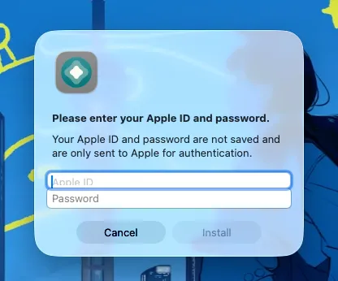
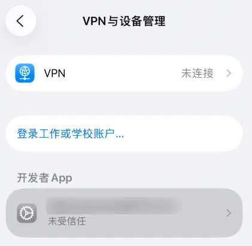
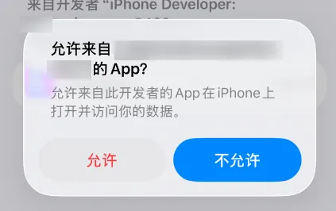
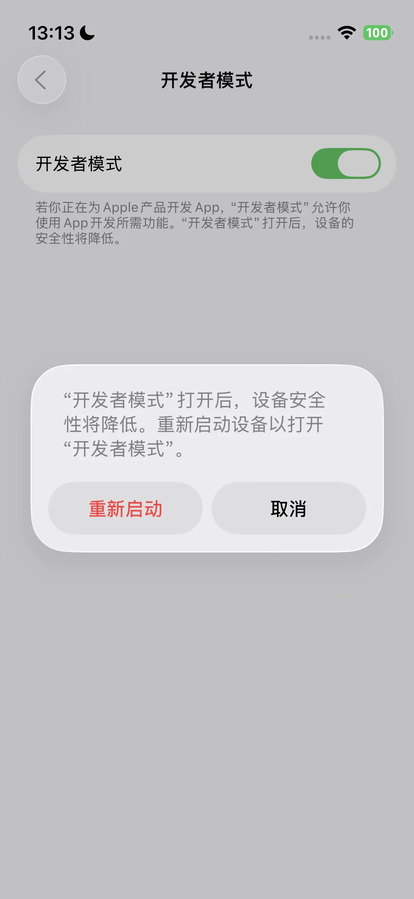
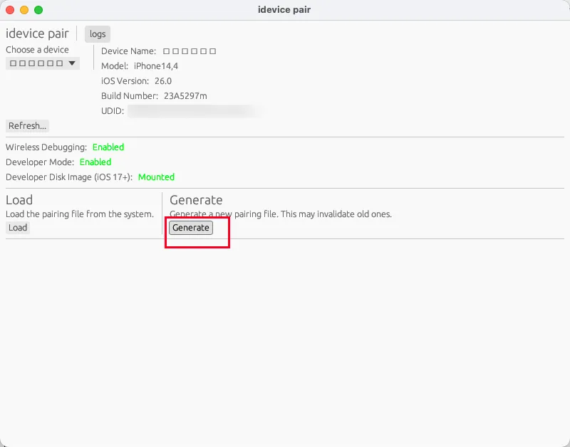
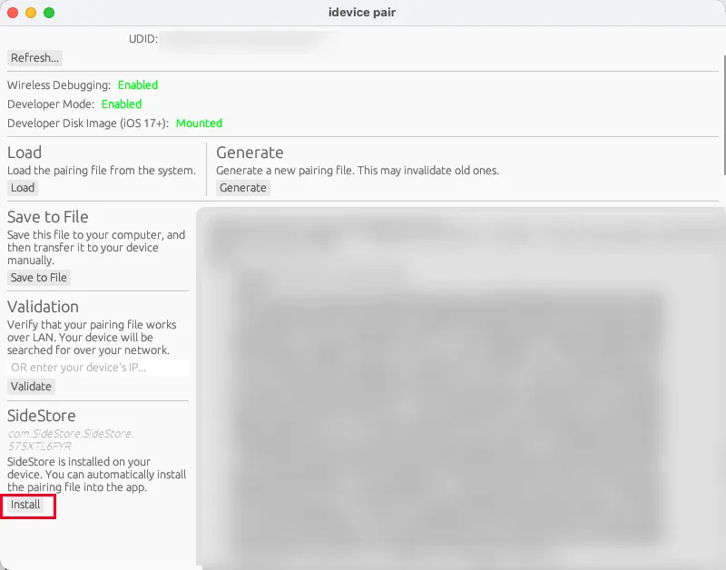
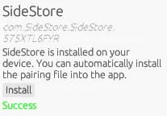
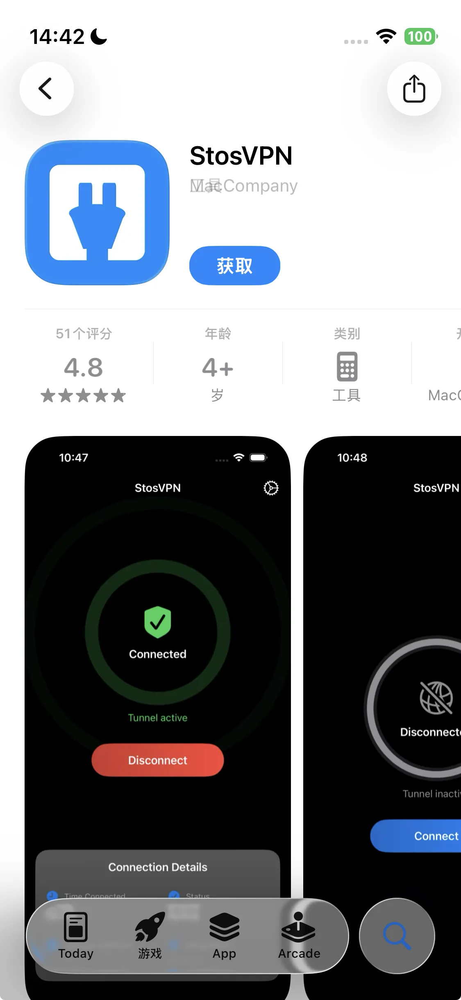
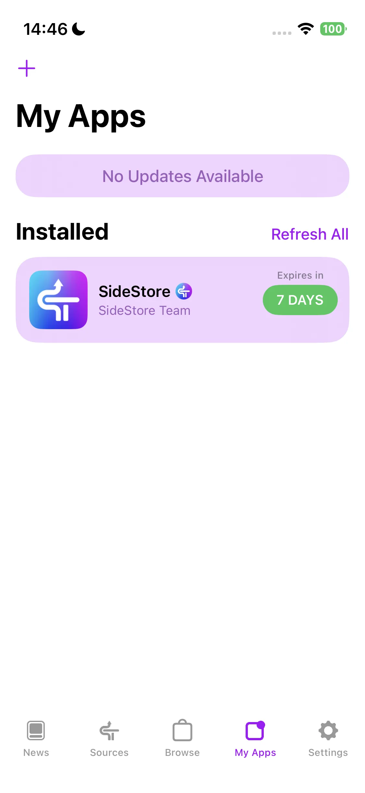
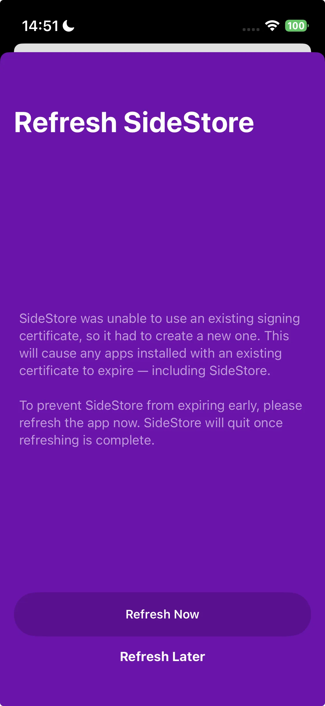

import PurchaseBanner from '@site/src/components/PurchaseBanner';

# AstroBox iOS版使用須知

<PurchaseBanner />

歡迎使用 AstroBox iOS 版！該版本由於開發適配難度較大，因此晚於其它平台上線，在此感謝您的耐心等待！

為了保證您能擁有我們預期中的良好使用體驗，不同於其它平台，您有以下特殊事項需要注意：

## 安裝

由於軟體本身的性質以及我們對私有 API 的使用，AstroBox 將永遠不可能上架蘋果官方的 AppStore，因此要在 iOS 裝置上安裝 AstroBox，您必須有一台電腦。如果您已配置好 SideStore / AltStore / LiveContainer / TrollStore 等本地側載環境，則可以直接下載 ipa 並進行安裝；如果並沒有，可以參考這篇文章（需掛梯訪問）或是下方教程進行配置，然後再安裝。

需要注意的是，iOS 版最低要求系統版本必須在 16.5 以上，想要得到更好的體驗需要在 17.0 以上。

### 使用電腦直接為 iOS 裝置安裝 AstroBox

> 本方法的優點是十分簡單，但壞處是每次更新都要使用電腦

#### 1.準備工作

首先，你需要準備以下內容才能按照本教程在 iOS 裝置上安裝 AstroBox：

- iOS 裝置

- 電腦

#### 2.前置內容安裝

##### Mac

對於 Mac 使用者，你需要在 AltStore 或 SideStore 官網 下載以下內容：

- AltServer

接著解壓`altserver.zip`，將解壓的`AltServer.app`文件拖放到「應用程式」資料夾中。

至此安裝過程完成。

##### Windows

對於 Windows 使用者，你需要在 AltStore 或 SideStore 官網 下載以下內容：

- AltServer

解壓`altserver.zip`，然後執行`setup.exe`來安裝 AltServer。Windows 使用者相比 Mac 使用者需要額外安裝非微軟應用商店版本的 iTunes 和 iCloud。如果已安裝微軟應用商店版本，請卸載。

至此，安裝過程完成

#### 3.通過 AltServer 安裝 AstroBox

首先，你需要通過線連接 iOS 裝置與你的 Mac，並在裝置上信任你的電腦。

接下來，請你啟動 AltServer（首次啟動時請在「應用程式」資料夾中右鍵開啟），按住 Option 鍵，點選頂端選單列中的 AltServer 圖示，然後選擇`AstroBox.ipa`

接下來請按照提示流程，輸入 AppleID 與密碼，等待 AstroBox 安裝完成，iOS 裝置上會出現 AstroBox 圖示。

接著進入 設定 > 一般 > VPN與裝置管理 > 選擇開發者 APP 選項 > 點選信任

接著前往設定 > 隱私權與安全性 > 開發者模式，開啟開發者模式並重啟

至此安裝完成。

:::tip

<mark class="pink">**需要注意的是：此安裝方式可能在七天後失效（？）**</mark>

:::

### 使用電腦在 iOS 裝置上建立本地側載環境後安裝 AstroBox

>本方式的優點是可以在 iOS 裝置上本地安裝 ipa 應用，而不需要每次都使用電腦安裝。接下來，我們將以 SideStore 為例進行演示。

#### 1.準備工作

首先，你需要準備以下內容才能按照本教程在 iOS 裝置上安裝 AstroBox：

- 美區 AppleID（其他非國區區域或許也可以）

- iOS 裝置

- 電腦

#### 2.前置內容安裝

##### Mac

對於 Mac 使用者，你需要在 SideStore 官網 下載以下內容：

- AltServer

- SideStore IPA

- idevice pair

接著開啟`altserver.zip`，將解壓的`AltServer.app`文件拖放到「應用程式」資料夾中。

然後開啟`iDevicePair--macos-universal.dmg`，把文件拖放到「應用程式」資料夾中。

至此安裝過程完成。

##### Windows

對於 Windows 使用者，你需要在 SideStore 官網 下載以下內容：

- AltServer

- SideStore IPA

- idevice pair

解壓`altinstaller.zip`壓縮檔，然後執行`setup.exe`來安裝 AltServer。Windows 使用者相比 Mac 使用者需要額外安裝非微軟應用商店版本的 iTunes 和 iCloud。如果已安裝微軟應用商店版本，請卸載。

接著執行`iDevicePair--windows-x86_64.exe`，完成安裝步驟。

至此，安裝過程完成。

#### 3.為裝置安裝SideStore

首先，你需要通過線連接 iOS 裝置與你的 Mac，並在裝置上信任你的電腦。

接下來，請你啟動 AltServer（首次啟動時請在「應用程式」資料夾中右鍵開啟），按住 Option 鍵，點選頂端選單列中的 AltServer 圖示，然後選擇`Sideload.ipa`

接下來請按照提示流程，輸入 AppleID 與密碼，等待 SideStore 安裝完成

接著進入 設定 > 一般 > VPN與裝置管理 > 選擇開發者 APP 選項 > 點選信任

接著前往設定 > 隱私權與安全性 > 開發者模式，開啟開發者模式並重啟

#### 4.推送配對檔案
首先確定你的 iOS 裝置有設定密碼（即鎖屏密碼），在通過線連接 iOS 裝置與你的 Mac 的條件下，將 iOS 裝置<mark class="orange">**返回主螢幕**</mark>，然後開啟前面的 iDevicePair 軟體（首次啟動時請在「應用程式」資料夾中右鍵開啟）

接著在軟體裡選擇裝置 > 點選 Generate

等待下方內容重新整理後，在 SideStore 選項卡裡點選 Install，等待出現 Success 選項

本步驟完成。

:::tip

<mark class="pink">需要注意的是：如果你更新或重設裝置，你的配對檔案將失效，你將要重新完成此步驟。</mark>

:::

#### 5.安裝StosVPN

接下來請你登入國區以外的 AppleID（比如美區），在 AppleStore 裡下載安裝 StosVPN。

接下來請開啟應用，點選連接。每當你希望使用 SideStore 安裝、更新或重新整理 AstroBox 時，都必須啟用此VPN，建議持續在後台開啟。

#### 6.重新整理應用並安裝

接下來請你開啟 SideStore 應用，進入 My Apps 選項卡，點選應用後的 “X Days” 按鈕，登入你的蘋果帳號。隨後點選重新整理。

在彈出的選項裡選擇第一個，即可配置好重新整理。最後點選左上角加號，選擇`AstroBox.ipa`文件即可安裝。

### 功能

#### 關於綁定裝置

因為 iOS 平台的特殊性，連接裝置與其他平台稍微不同，請你嚴格按照以下順序綁定裝置：

1. 在設定 - 藍牙裡忽略相關裝置

2. 開啟設定，登入小米帳號，取得並複製 Authkey（你也可以選擇其他方式取得 Authkey）

3. 開啟裝置頁，點選連接裝置

4. 等待下方<mark class="orange">**掃描結果裡**</mark>出現裝置後貼上 Authkey

5. 連接完成

6. <mark class="pink">**之後當你再次開啟 AstroBox，如果點選重新連接裝置等待許久後無法連接，請你在設定 - 藍牙裡忽略相關裝置，再次進入點選重新連接**</mark>

#### 關於資源安裝速度

在基本功能上，iOS 版 AstroBox 的特性與其它平台並無太大區別。但由於藍牙底層連接方式的變化，<mark class="pink">**在 iOS 上安裝資源的速度將始終比其它平台慢 3-5 倍**</mark>。

#### 關於「安卓偽裝模式」

如果您嘗試安裝快應用，由於小米官方的限制，在 Xiaomi Watch S4、REDMI Watch 5 等裝置上，安裝的快應用將不會顯示，也無法通過 AstroBox 的「快應用管理」功能開啟，此時需要切換到「安卓偽裝模式」以進行裝置能力解鎖。

米衝高，關鍵年。由於誰也不知道的原因，當您使用 Xiaomi Watch S4、Redmi Watch 5 等裝置連接 iOS 手機時，裝置上的所有快應用將被系統隱藏，甚至新安裝的快應用也無法被「註冊」並正常開啟。

為應對此問題，AstroBox 提供了「安卓偽裝模式」。啟用該模式後，AstroBox 會在斷開當前裝置連接後，將自身偽裝成一台安卓手機，並嘗試重新連接您的穿戴裝置。此時，穿戴裝置將誤認為其已連接到安卓裝置，從而恢復對快應用的註冊與展示能力。此後，即便關閉「安卓偽裝模式」並重新連接裝置，AstroBox 的「快應用管理」功能仍可用於開啟這些已「註冊」的快應用。

請注意：由於小米系統的識別機制限制，iOS 裝置在「安卓偽裝模式」下連接穿戴裝置後，僅能短時間維持連接，隨後將被系統識破並斷開。因此，在此模式下無法進行資源的管理或安裝操作。如需使用上述功能，需關閉「安卓偽裝模式」並重新連接裝置，但這將再次觸發快應用的隱藏。

是否啟用該模式，需視您的實際需求而定。簡而言之：

- 想讓快應用顯示：啟用「安卓偽裝模式」，連接裝置；

- 想管理或安裝資源：關閉該模式並重新連接裝置。

我們建議您根據具體場景靈活使用，並理解相關限制。

:::tip

<mark class="pink">**最後，因為 iOS 版本適配困難，奇怪的問題非常多，所以請您在使用時多加嘗試！感謝您的理解！**</mark>

:::

:::note

本教程由Yulimfish,Searchstars等人編寫，本人（lladlam）僅為第三方轉載，著作權歸Yulimfish,Searchstars等人所有

:::