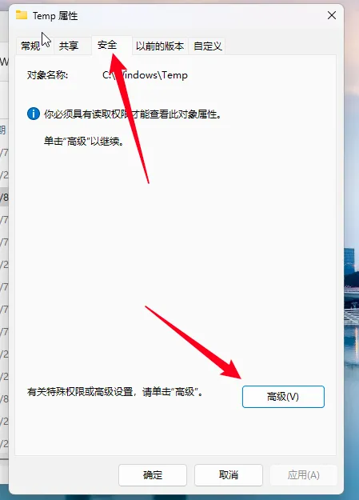

import PurchaseBanner from '@site/src/components/PurchaseBanner';

# 入門/安裝篇

<PurchaseBanner />

## 手機安裝的時候顯示「解析軟體套件出現問題」？
請檢查你的安卓版本是否在<mark>**安卓 10 及以上**</mark>，13 以下版本穩定性差，<mark>**推薦使用 13 及以上安卓版本**</mark>。

## Q1：Mac 開啟顯示「『AstroBox.app』已損壞，無法開啟。你應該將它移到垃圾桶。」？
在命令列執行以下指令並輸入密碼

```bash
sudo xattr -r -d com.apple.quarantine /Applications/AstroBox.app
```

## Q2：Windows 安裝的時候顯示報錯碼 2502/2503？


首先去官網重新下載安裝包，看看安裝包有沒有在下載過程中損壞了。

如果不行，那就是 msi 的安裝權限問題。<mark class="orange">首先先確認你是否將主程式解壓後再開始執行，如沒有請先解壓後再試</mark>，如還不行就請你按照以下流程操作：


<details>
	<summary>點選此處展開/摺疊內容</summary>
	
	1.右鍵此資料夾，點選內容
	
	
	
	2. 在安全選項卡下選擇當前使用者，點選編輯

	

	
	
	3.選擇完全控制後點選確定
	
	
	
	4.回到原頁面點選應用
	
	
	
	點選左側箭頭展開
	1. 右鍵此資料夾，點選內容
	
	2. 在安全選項卡下選擇當前使用者，點選編輯
	
	3. 選擇完全控制後點選確定
	
	4. 回到原頁面點選應用
	
	接下來可再次啟動安裝包嘗試安裝。
</details>

## Q3：首頁載入速度慢/載入失敗？
可以在設定中<mark>更換CDN</mark> 並重啟，建議換成 ghp；如果你能接受一直開啟代理使用，直接改成 raw 也可以

或者你也可以嘗試一下在WiFi列表，開啟右邊設定，IP 設定，改為靜態，把 DNS1 改 114.114.114.114 或者223.5.5.5（這個可以寫到DNS2上面），DNS2 可改 8.8.8.8，然後返回會重新連接，再次重新整理試試！

## 🌟 Q4：首頁就像下面這樣空白/設定頁劃不動？
此種空白的特徵是：

1. banner 能夠顯示

2. 應用列表下只顯示「已經被一查到底了」

3. 並且恰好你設定頁也劃不動

滿足以上特徵可以嘗試此方法。

根據群友回饋，大概率此問題為系統 Webview 版本過低，請你將 Webview 更新到 115+

你可以嘗試進入這個連結下載，優先選擇共享庫版本：https://www.123pan.cn/s/Zg85Vv-Fte8.html

如果安裝失敗可以檢查安卓版本 或 在開發者選項關閉系統最佳化（比如 MIUI 最佳化）

如果是華為手機，安裝後依舊無法使用，可以嘗試在上面的連結裡尋找華為版本的 Webview 安裝，然後進入開發者選項-Webview 實作那邊切換，兩種都試試。

## Q5：動畫卡頓/異常？
手機端出現這個問題是正常的，需要驍龍8G1以上晶片才能較好地展示動畫。

## ~~Q6：Windows 11 裝置更新到 1.5.0 主頁白屏/什麼都點不動~~
<mark class="pink">在 1.5.1 版本中已修復，請更新到最新版本</mark>

---
:::tip

不同系統有不同的版本號，注意區分

:::

---

## ~~Q7：鴻蒙用不了/裝不了~~
<mark class="pink">在 1.2.0 版本中已可使用，只要你的安卓版本大等於 10</mark>

~~需要AOSP版本大於等於 13 的鴻蒙，如果是鴻蒙Next 可以直接使用卓易通嘗試。目前已嘗試的大部分華為機型都不可以使用，你可以試試，大概率也不行~~

## ~~Q8：協議頁點不了同意？~~
<mark class="pink">此問題在 1.0.1 版本中已修復</mark>

~~首先請確定你是否把協議看完，<mark>劃到底部了</mark>。若依舊無法點選，請<mark>掛小窗再點</mark>，後面會修復這個問題~~

:::note

本教學由Yulimfish，川.，wuhaiqi等人編寫，lladlam轉載時經過修改，著作權歸Yulimfish，川.，wuhaiqi等人所有

:::