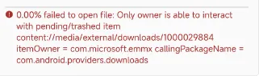
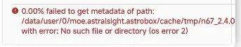
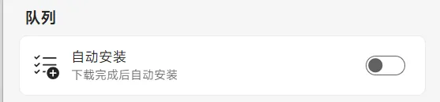
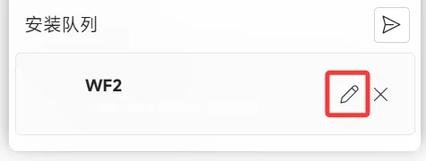

import PurchaseBanner from '@site/src/components/PurchaseBanner';

# 下載安裝資源篇

<PurchaseBanner />

## Q1：首頁的 bandbbs 欄目為什麼空的/顯示「No BandBBS account」？
你沒在設定裡登入米壇帳號

## Q2：Bandbbs 的資源點選下載後不會和官方源一樣自動下載？
Bandbbs 的資源點選下載後需要選擇下拉框裡的檔案再下載安裝，請下載前自行確定資源適配的穿戴裝置型號是否與你的裝置型號一致。

## Q3：資源顯示 404 或「resource not found」

這個資源不存在，請聯絡資源作者解決

## Q4：出現「error sending request for url」怎麼辦

你可以嘗試在設定中切換 CDN，並重啟應用，如果都不可以請嘗試魔法

## Q5：出現「No devices are connected」/「deadline has elapsed」怎麼辦

請確認手環是否已經連接，回到主頁確定當前連接狀態，建議多重啟應用，重試幾次。

## Q6：出現「channel closed」怎麼辦
可能是手環與ab的連接斷開，此時可以嘗試重新連接；

也可能是 Authkey 錯誤，這個是由於恢復出廠後/隨機的某個時間 Authkey 會更換，重新連一下小米運動健康，然後會 AstroBox 登入小米帳號同步最新的 Authkey 即可

## Q7：出現「Prepare not READY!」怎麼辦

請確保手環擁有充足的儲存空間或電量，然後重啟手環，如果還是不行請點選資源旁邊的編輯按鈕隨便改一個 id。

對於 Redmi Watch 5 esim，請你降級版本，系統限制了應用安裝。

## Q8：出現「Timeout waiting for protokey」怎麼辦

請重啟 AstroBox 和手環並再次嘗試

## Q9：出現「failed to open file」怎麼辦

1. 請檢查自己的檔案是否下載完整

2. 檢查是否授予 AstroBox 足夠的檔案讀取權限

## Q10：出現「failed to get metadata of path」怎麼辦

你可以檢查一下手環是否安裝上了這個應用，大概率是 AstroBox 本身的 bug

## Q11：出現「url is not a valid path」怎麼辦

請檢查你的檔案格式是否正確，通常為 bin 或者是 rpk（快應用）

## 🌟 Q12：韌體安裝可以用嗎？

:::danger

<mark class="pink">請最好別用安卓手機傳輸韌體，容易丟包，建議用其他裝置嘗試。安卓的韌體安裝功能建議移步隔壁Notify For Xiaomi。韌體安裝過程中請不要對手機、手環做任何操作！不要安裝非同一型號、非同一地區的韌體到手環！韌體安裝是十分危險的行為，導致任何後果 AstroBox 團隊概不負責！如果你要嘗試韌體安裝，推薦將設定裡的發包間隔改為 10。</mark>

:::

## Q13：下載安裝了兩個或多個錶盤，裝置只顯示其中一個，怎麼辦？
這種問題是資源開發者沒有使用了同一個錶盤ID導致的資源替換，請依照以下方法操作

1. 在設定中關閉自動安裝功能

2. 下載/安裝本地資源，在佇列裡點選下方紅圈內的「畫筆」圖示

3. 在彈窗中隨意輸入9/12位數字，或點選紅圈的「隨機」圖示，然後點選下方修改按鈕

4. 點選紅圈所示按鈕傳送錶盤到裝置即可

:::note

本教學由Yulimfish，川.，wuhaiqi等人編寫，本人（lladlam）僅為第三方轉載，著作權歸Yulimfish，川.，wuhaiqi等人所有

:::